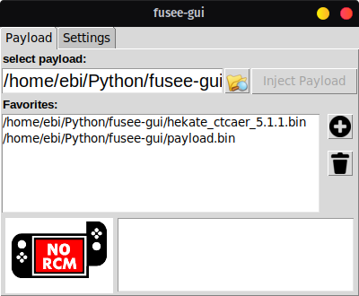

# fusee-gui
A Gui interface for fusee-gelee(The nintendo switch exploit) and pretty much a bootleg version of tegrarcmgui
# Features
* Injecting payloads(obviously)
* Managing favorites
* Patching EHCI drivers so you can inject the payload through all usb ports on Linux devices
## Notes about EHCI driver patch
Patching the EHCI drivers is only needed on Linux you don't need it on mac and windows 

The patch is temporary so after you restart your device you have to patch it again

if you see oparation not permited in the log don't freak out that's what its supposed to say and its probably fine

using an EHCI port to inject is unreliable so your switch may not boot , to fix that just hold the power button for 12 - 15 seconds (or as long as the program no longer detects your switch) then do a single tap on the power button and it should detect it again and then try to inject the payload again

## Usage on windows
if you want to try this out on windows follow [this](https://github.com/Qyriad/fusee-launcher/wiki/Instructions-(Windows)) guide and then you can use my program , but if you want something for longterm use then use [this](https://github.com/eliboa/TegraRcmGui) instead
# Credits
* [Kate Temkin](https://twitter.com/ktemkin "Her twitter") for discovering the fusee-gelee exploit
* [falquinho](https://github.com/falquinho) for making fusee-gelee as a module
* [David Buchanan](https://gist.github.com/DavidBuchanan314 "His gist repository") for the EHCI patch code 
* [eliboa](https://github.com/eliboa) because I pretty much stole his design for TegraRcmGui